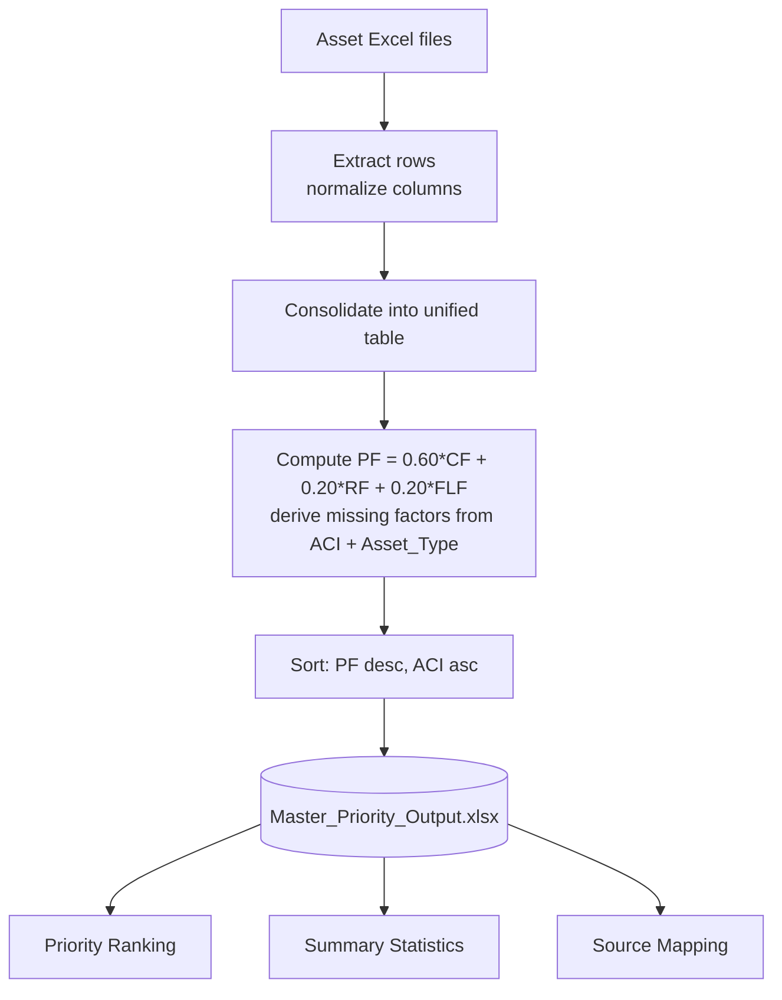

# RTA Asset Management - Master Excel Workflow

This document describes how the multiple per-asset-type Excel inputs are consolidated into a single ranked `Master_Priority_Output.xlsx`.

The orchestration entry point is `generate_master_priority(...)` in `scripts/generate_master_priority.py` (CLI: `main(...)` at the bottom of the same file).

---

## Flowchart



---

## Stage-by-stage walkthrough

### 1. Discovery - which files do we read?

`generate_master_priority` either takes explicit paths from the CLI or auto-discovers every `.xlsx` in the parent directory (skipping Excel lock files and the prior output):

```python
def discover_input_files(input_dir: Path) -> list[Path]:
    candidates = sorted(input_dir.glob("*.xlsx"))
    return [
        p for p in candidates
        if not p.name.startswith("~$")
        and p.name.lower() != "master_priority_output.xlsx"
    ]
```

Today this picks up `RoW Assets_ACI Sheet_20-05-2025.xlsx`, `MASTER_EXCEL_E11.xlsx`, `1. Calculations for Priority Index.xlsx`, and any other workbook dropped into the parent directory.

### 2. Per-sheet extraction - finding inventory data inside messy workbooks

Each file is opened read-only with openpyxl, then every sheet is processed independently. Two heuristics make this robust to the wildly different shapes of the source files:

- **Header detection** (`_find_header_row`) scans the first 12 rows and prefers the one that looks textual *and* contains ACI / PF / CF / RF / FLF. This handles merged title rows and headers that don't start on row 1.
- **Inventory check** (`is_inventory_sheet`) rejects summary-style sheets (e.g. "Combined Data", "Summary", "Priority Factor Cal Sheet") and keeps only sheets with an ACI-like column.

Headers are then normalized and looked up in `COLUMN_ALIASES`, so `OBJECTID *`, `Element_ID`, `Unique_Asset_Name` all collapse into a single canonical `Asset_ID`. Defect-style columns are folded into a single human-readable `Description`, and anything we don't recognize is preserved in an `extras` bag so nothing is lost.

Each surviving row becomes an `AssetRow` stamped with `Source_File` / `Source_Sheet`, and `Asset_Type` is inferred from the sheet name if no column provides it.

### 3. Consolidation + PF backfill

`consolidate` flattens every `SheetExtract` into one list and orders the "extra" columns deterministically (by frequency, then first-appearance).

Then `compute_missing_pf` runs per row with this priority:

1. **PF already in the source** -> keep it; mark `PF_Computed = False`.
2. **CF / RF / FLF all present** -> apply the weighted formula directly.
3. **Only ACI + Asset_Type present** -> derive the missing factors via the validated domain modules and *then* apply the formula.

The derivations come from:

| Factor | Source | Formula |
|---|---|---|
| CF | `domain/pf/cf.py` | `IF(ACI>=80, 0, (80-ACI)/80*100)` |
| RF | `domain/pf/rf.py` (uses `domain/lookups/`) | `10 + ((score - min)/(max - min)) * 90` |
| FLF | `domain/pf/flf.py` (uses deterioration curves) | `(ACI - intercept)/slope / total_life * 100`, clamped to [0, 100]; `ACI=0 -> 100`, `ACI>=80 -> 0` |

Final score, mirroring `domain/pf/aggregator.py`:

```
PF = 0.60 * CF + 0.20 * RF + 0.20 * FLF
```

### 4. Sort

Single key, three levels:

```python
return (-pf, aci, asset_type)
```

- PF descending (highest priority first)
- ACI ascending tiebreaker (worst condition first)
- Asset_Type alphabetical for deterministic ordering
- Rows with no PF / ACI sink to the bottom

### 5. Writing the output workbook

Built with **xlsxwriter** in `constant_memory` mode (much faster than openpyxl on 40k+ rows and produces non-corrupt archives). Three sheets are emitted from the same in-memory `all_rows`, so the workbook is internally consistent.

| Sheet | Function | Key behaviors |
|---|---|---|
| **Priority Ranking** | `write_priority_sheet` | Rank uses `=ROW()-1` (survives filtering); 3-color scales on PF (green->red) and ACI (red->green, inverse); frozen header; autofilter; 2-dp number format on ACI/CF/FLF/RF/PF; auto-fit widths capped at 40 |
| **Summary Statistics** | `write_summary_sheet` | Live Excel formulas (`AVERAGE`, `MEDIAN`, `MIN`, `MAX`, `COUNTIF`, `PERCENTILE`) referencing the Priority Ranking range - nothing is hardcoded. Includes a "Top 10 highest priority" table whose cells are formulas referencing Sheet 1 |
| **Source Mapping** | `write_source_mapping_sheet` | Per `(file, sheet)` row count + asset-type breakdown, per-file totals, generation timestamp |

---

## TL;DR mental model

`Raw multi-sheet workbooks` -> normalize headers/rows -> `unified AssetRow list` -> backfill PF from ACI + asset type via the domain factor modules -> sort by PF desc / ACI asc -> emit one nicely-formatted 3-sheet workbook with live formulas.

---

## Related docs

- [TESTING_GUIDE.md](./TESTING_GUIDE.md) - how to run unit tests and regenerate the master output
- `scripts/generate_master_priority.py` - the orchestrator implementing this workflow
- `domain/pf/aggregator.py` - canonical PF formula reference
